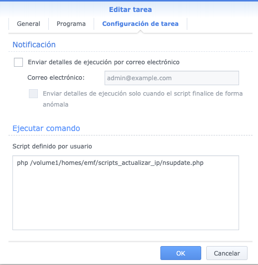
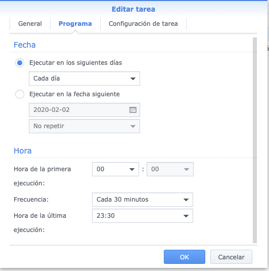

# dnsupdateSynolog

PHP script to update IP Address from a dinahosting domain, updating a DNS A zone.

#### How to use

In my case, I create a Task Scheduler into a Synology NAS, executing the script each half hour.

